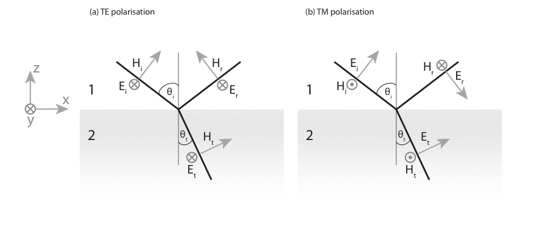

Fresnel formulae
========================================================
<!-- 
%\VignetteEngine{knitr::knitr}
%\VignetteIndexEntry{fresnel}
-->

## Single interface

Let us consider the situation depicted below, 

where we define the Fresnel coefficients as the ratio of the complex _amplitude_ of the _electric_ fields, $r= E_r/E_i$ for the reflection coefficient, and $t= E_t/E_i$ for the transmission coefficient. The Fresnel coefficients can be obtained by considering the continuity of the tangential component of the $E$ and $H$ fields at the interface. The continuity of the normal components of $D$ and $B$ does not yield supplementary conditions and will not be considered. It is worth noting that the continuity of $H^y$ is only valid for materials that do not sustain a surface current resulting from the addition of external charges. 

### TE-polarised light

For TE-polarised light, the continuity of $E^y$ reads,
\[
E_i + E_r  = E_t
\]
which yields,
$$
  1+r =t.
$$
The continuity of $H^x$ can be written as,
$$
H_i\cos\theta_i - H_r\cos\theta_i  = H_t\cos\theta_t
$$
It is convenient to express the angles in terms of the normal component of the $k$-vectors,
$$
  k_z = n k_0 \cos\theta.
$$
for the incident, reflected, and refracted fields, so that $\cos\theta_t / \cos\theta_i=\dfrac{k_{z2}n_1}{k_{z1}n_2}$. The complex magnitude of the magnetic and electric fields are linked in each medium by the optical impedance. Its expression can be obtained from the induction law in a homogeneous medium,
\[
\nabla\times\mathbf{E} = -\partial_t \mathbf{B}
\]
expressed in Fourier space\footnote{assuming here a homogeneous plane wave} as,
\[
\mathbf{k}\times \mathbf{E} = i\omega \mathbf{B}
\]
The ratio $E/H$ is the impedance, written as,
$$
  \frac{E}{H}= c \mu \mu_0 / n= \sqrt{\frac{\mu\mu_0}{\varepsilon\varepsilon_0}}=Z\cdot Z_0.
$$
We can define the admittance $Y$ as the inverse impedance, $Y=\dfrac{1}{Z\cdot Z_0}$
The continuity of $H^y$ can be expressed as,
\[
Y_1 (1 - r) =  Y_2 \frac{n_1k_{z2}}{n_2k_{z1}}t.
\]
After rearranging, we obtain,
$$
  1 - r = \frac{\mu_1k_{z2}}{\mu_2k_{z1}}t.
$$
We can summarize the two continuity relations in the following system,

$$\left\{
\begin{aligned}
1 + r &= t\\
1 - r &= \frac{\mu_1 k_{z2}}{\mu_2 k_{z1}}t
\end{aligned}\right.
$$
Solving for $r$ and $t$ yields the result,
$$
t_{12}^s=\frac{2\mu_2 k_{z1}}{\mu_2 k_{z1}+\mu_1k_{z2}},\qquad r_{12}^s=\frac{\mu_2 k_{z1}-\mu_1k_{z2}}{\mu_2 k_{z1}+\mu_1k_{z2}}.
$$

### TM-polarised light

For TM-polarised light, it is generally easier to consider the Fresnel coefficients for the magnetic field, denoted $\rho$ and $\tau$. The continuity of $H^y$ reads,
\[
1 - \rho = \tau
\]
The continuity of $E^y$ can be written,
\[
\frac{k_{z1}}{\varepsilon_1} + \rho \frac{k_{z1}}{\varepsilon_1} = \tau \frac{k_{z2}}{\varepsilon_2}
\]

We can summarize the two continuity relations in the following system,

$$\left\{
\begin{aligned}
1 - \rho &=\tau\\
(1 + \rho) \frac{k_{z1}}{\varepsilon_1}&=\frac{k_{z2}}{\varepsilon_2}\tau
\end{aligned}\right.
$$
Solving for $\rho$ and $\tau$ yields the result,
$$
\tau_{12}^p=\frac{2\varepsilon_2 k_{z1}}{\varepsilon_2 k_{z1}+\varepsilon_1k_{z2}},\qquad 
\rho_{12}^p=\frac{\varepsilon_2 k_{z1}-\varepsilon_1k_{z2}}{\varepsilon_2 k_{z1}+\varepsilon_1k_{z2}}.
$$

To summarize, for a single interface from 1 to 2 with normal along the $z$ direction, the Fresnel coefficients read,
$$
	\begin{aligned}
	\rho_{12}^p&=\frac{\varepsilon_2 k_{z1}-\varepsilon_1k_{z2}}{\varepsilon_2 k_{z1}+\varepsilon_1k_{z2}},&{}& r_{12}^s=\frac{\mu_2 k_{z1}-\mu_1k_{z2}}{\mu_2 k_{z1}+\mu_1k_{z2}}\\
	\tau_{12}^p&=\frac{2\varepsilon_2 k_{z1}}{\varepsilon_2 k_{z1}+\varepsilon_1k_{z2}},&{}& t_{12}^s=\frac{2\mu_2 k_{z1}}{\mu_2 k_{z1}+\mu_1k_{z2}}.
	\end{aligned}
$$

Note that,
$$
	r_{ij}=-r_{ji}.
$$
To verify the conservation of energy, one must consider the irradiance defined in terms of the electric field as $I=\frac{1}{2}Y|E|^2$, yielding,
$$
  R=\frac{I_r}{I_i}=|r|^2, \qquad T=\frac{I_t}{I_i}=\frac{Y_1}{Y_2}|t|^2.
$$
and we can verify that, indeed, $R+T=1$ for a single interface.

## Reflectivity of a layer

From the viewpoint of ray optics, a thin layer will support an infinite number of internal reflections (absorption and irregularities will however reduce the intensity in a physical situation). The infinite series of reflected orders can be expressed in the form a geometric sum, leading to a closed form formula as shown below.

An incident plane wave with amplitude $A$ impinges on the first interface. It can be reflected, $B=r_{01}A$, or transmitted. The total response of the slab can be obtained by following each order of reflection inside the slab (`C`, `D`, $\dots$).

Upon transmission at the first interface, the wave amplitude is $t_{01}A$. Application of Fermat's principle yields a phase change $\Delta \phi= k_{z1}d$ when the wave hits the second interface. The reflection coefficient at this interface is $r_{12}$. The partial wave reflected from this path, noted `C`, is therefore $C=t_{10}t_{01}r_{12}\exp(2i k_{z1}d)A$.

Similarly, in `D`, \[
	D=t_{10}t_{01}r_{10}r_{12}^2\exp(4i k_{z1}d)A
	\]
And, for the ${j^\text{th}}$ partial wave,
	\[
	t_{10}t_{01}r_{12}^{j}r_{10}^{{j-1}}\exp(2i {j}k_{z1}d)A
	\]
The wave reflected by the slab is the sum of these contributions,
	\[
	r_{\text{slab}}A=B+C+D+\dots=\left[r_{01}+t_{10}t_{01}r_{12}\sum_{j=0}^{\infty}r_{12}^jr_{10}^{j}\exp(2ji k_{z1} d)\right]A
	\]
For clarity, I write $\beta=r_{12}r_{10}\exp(2i k_{z1}d)$. The summation of all partial waves is thereby expressed as a geometrical sum,
	\[
	r_{\text{slab}}=r_{01} + \left(t_{10}t_{01}r_{12}\exp(2i k_{z1}d)\right)\sum_{j=0}^{\infty}\beta^j
	\]
Recalling that the sum of a geometric series of common ratio $q$ is $\frac{1}{1-q}$, we can write,
	\[
	r_{\text{slab}}=r_{01} + \frac{t_{10}t_{01}r_{12}\exp(2i k_{z1}d)}{1-r_{12}r_{10}\exp(2i k_{z1}d)}
	\]

We note that for either polarisation we have the following identity,
$$
	t^s_{ij}t^s_{ji}  = (1-r^s_{ij})(1+r^s_{ij})= 1-(r^s_{ij})^2 ,\qquad 
	t^p_{ij}t^p_{ji}  =\frac{Y_i}{Y_j}(1-r^p_{ij})\frac{Y_j}{Y_i}(1+r^p_{ij}) = 1-(r^p_{ij})^2
$$
Using this equation and the substitution $r_{10} = -r_{01}$ we finally obtain,
$$
		r_{\text{slab}}=\frac{r_{01}+r_{12}\exp(2i k_{z1}d)}{1+r_{01}r_{12}\exp(2i k_{z1}d)}.
$$

For the transmission, one obtains,

$$
		t_{\text{slab}}=\frac{t_{01}t_{12}\exp(i k_{z1}d)}{1+r_{01}r_{12}\exp(2i k_{z1}d)}.
$$

## Reflectivity of a multilayer structure

When N layers are stacked together, the reflection coefficient of the structure can be found by applying recursively the preceding formula for a single layer. This amounts to considering one of the reflection coefficients to be the effective reflection accounting for all the layers behind. Let us consider explicitly the case of a 3 layer system. The procedure is as follows,

* Compute and store for later use all single-interface coefficients, namely $r_{01}$, $r_{12}$, $r_{23}$, $r_{34}$
* Combine the previous coefficients to compute the reflectivity of the last layer, i.e. $r_{24} = \frac{r_{23}+r_{34}\exp(2i k_{z3}d_3)}{1+r_{23}r_{34}\exp(2i k_{z3}d_3)}$. This value can be stored in a temporary variable $r_{\text{tmp}}$
* Go up, combining one interface at a time, $r_{\text{tmp}}=r_{14} = \frac{r_{12}+r_{24}\exp(2i k_{z2}d_2)}{1+r_{12}r_{24}\exp(2i k_{z2}d_2)}$
* the combined reflectivity of the multilayer is obtained when one has reached the top interface, $r_{\text{tmp}} = r_{04} = \frac{r_{01}+r_{14}\exp(2i k_{z1}d_1)}{1+r_{01}r_{14}\exp(2i k_{z1}d_1)}$

